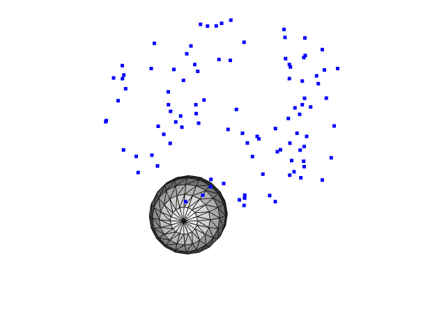

# Parametric Sphere Fitting

A parametric sphere is fit to a point cloud using ideas from https://github.com/awf/OpenSubdiv-Model-Fitting. There are 6 parameters: 3 for scale, 3 for translation.

## Requirements
- Modified Eigen branch at https://bitbucket.org/sergarrido/eigen_pr/src/block-lma-awf-expts/ for Block sparse Levenberg-Marquardt
- [OpenSubdiv](http://graphics.pixar.com/opensubdiv/docs/intro.html) for Loop Subdivision evaluation and derivatives
- [Open3D](http://www.open3d.org/) for visualization

## Usage
```bash
cmake -S . -B build -DCMAKE_BUILD_TYPE=Release
cmake --build build
./build/fit_sphere
```

## Result

